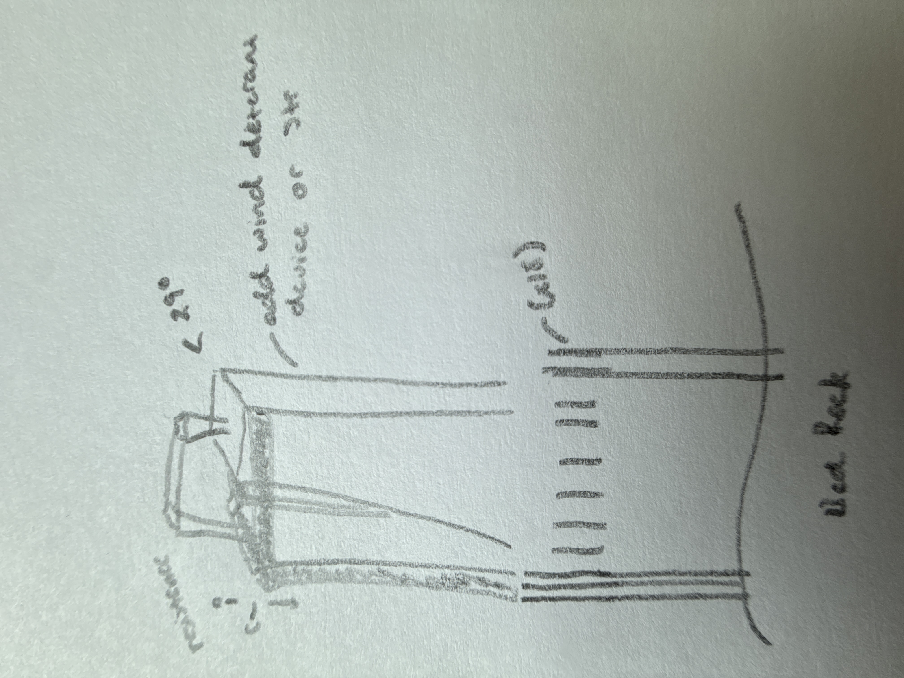

# Millennium Tower — Full Phased Correction Analysis

**A structural analysis proposing a three-phase fix for San Francisco's sinking Millennium Tower: stabilize with buttress ties, level with soil extraction, lock in with jet grouting.**


---

## The Problem

San Francisco's Millennium Tower (58 stories, 645 ft) has sunk 18+ inches and leans ~28 inches. The $120M Perimeter Pile Upgrade has underperformed — and the center of the foundation is now sinking independently, a problem perimeter piles can't address.

## The Proposal: Set It, Align It, Lock It In

Like orthopedic surgery: set the bone, align it, put in the screws.

### Phase 1 — Stabilize (Buttress Ties)
Build concrete buttress pillars adjacent to the tower, founded on bedrock piles. Connect them to the tower with post-tensioned tendons. The building stops moving.

### Phase 2 — Level (Soil Extraction / Pisa Method)
Once stable, remove clay from under the high side. The high side settles to meet the low side — gravity does the work. The buttress ties act as a safety net. This is exactly how the Leaning Tower of Pisa was corrected.

### Phase 3 — Lock In (Jet Grouting)
Inject high-pressure cement into the clay beneath the foundation, creating soilcrete columns that replace water-saturated clay with rigid cement. This eliminates the tidal pumping cycle (Bay water entering and leaving clay pores twice daily) that drives ongoing settlement. The correction is locked in permanently.

## Original Concept Sketch



## Key Results

| Metric | PPU Only | Hybrid | Phased | Full Phased | vs PPU |
|--------|----------|--------|--------|-------------|--------|
| Top displacement | 68.1 in | 24.0 in | 31.4 in | **15.4 in** | **77% ↓** |
| Center dishing | 54.1 mm | 47.9 mm | 29.1 mm | **12.3 mm** | **77% ↓** |
| Max settlement | 458.4 mm | 233.3 mm | 264.5 mm | **162.8 mm** | **64% ↓** |
| 30-year creep | 47 in | 11.3 in | 11.0 in | **0.5 in** | **99% ↓** |
| Tie force/buttress | — | 428 kips | 561 kips | **275 kips** | — |

**The 30-year creep number tells the whole story.** PPU drifts 47 inches over 30 years. Full phased drifts half an inch. The building stops moving.

### Implementation Timeline

```
Years 0-17:   PPU only (as-built, worsening)
Years 17-20:  Phase 1 — Buttress installed, movement arrested
Years 20-25:  Phase 2 — Soil extraction, building levels out
Years 25-28:  Phase 3 — Jet grouting, correction locked in
Years 28-35:  Monitoring — 0.5" of movement over 7 years
```

## Why Each Phase Matters

Each phase solves a different problem:

- **Buttress alone** = corrects tilt but clay keeps degrading
- **Extraction alone** = too dangerous on an unstable building
- **Grouting alone** = stabilizes but can't correct existing tilt
- **All three in sequence** = stabilize, correct, then make it permanent

The grouting is what makes the whole system durable. Without it, every other fix is fighting the tidal cycle — water pumping through clay pores twice daily, slowly ratcheting down bearing capacity. Grouting replaces the water with cement. The cycle stops.

## Repo Structure

```
├── analysis/
│   ├── millennium_model.py       # Structural model (5 scenarios)
│   ├── run_analysis.py           # Entry point
│   └── results/                  # JSON output
├── dashboard/
│   └── millennium_dashboard.jsx  # Interactive React visualization
├── docs/
│   ├── METHODOLOGY.md            # Model approach
│   ├── FINDINGS.md               # Results interpretation
│   └── LIMITATIONS.md            # Caveats and next steps
├── assets/
│   └── concept_sketch.jpg        # Original concept sketch
└── README.md
```

## Running

```bash
pip install numpy scipy
cd analysis && python run_analysis.py
```

Dashboard: drop `dashboard/millennium_dashboard.jsx` into any React environment with `recharts`.

## Limitations

Simplified 1D proof-of-concept. Key gaps: 3D modeling, nonlinear soil, seismic/wind, construction staging, grouting heave risk, cost analysis. See [LIMITATIONS.md](docs/LIMITATIONS.md).

## License

MIT
